<picture>
  <source media="(max-width: 600px)" srcset="./assets/hero-mobile.svg">
  
</picture>

  
  
  <a href="#selected-projects"></a>
  

  <picture>
    <source media="(max-width: 600px)" srcset="./assets/typing-mobile.svg">
    
  </picture>

  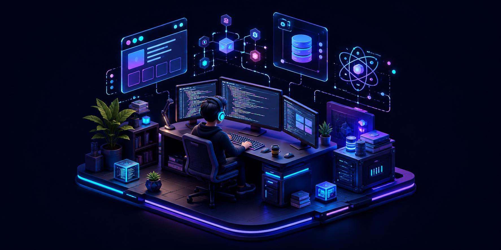

<h3 align="center">👋 Hey, I'm Bình. I build across the stack.</h3>

  A <strong>Full Stack Developer from Vietnam</strong> with a frontend eye for detail. 
  I connect thoughtful interfaces with the APIs, data, and infrastructure behind them. 
  Currently building in <strong>developer learning</strong>, <strong>workplace training</strong>, and <strong>IT recruitment</strong>.

<picture>
  <source media="(max-width: 600px)" srcset="./assets/core-mobile.svg">
  
</picture>


<h2 align="center">⚡ Tech arsenal</h2>

<samp>The tools behind the interfaces, services, and everything in between.</samp>

<picture>
  <source media="(max-width: 600px)" srcset="./assets/tech-stack-mobile.svg">
  
</picture>

  
<b>Explore the stack by layer</b>

| Layer | Technologies |
| :--- | :--- |
| Frontend | TypeScript · JavaScript · React · Next.js · Tailwind CSS |
| Backend | Node.js · NestJS · Express · Prisma · REST APIs · Zod |
| Data & cloud | PostgreSQL · Supabase · MongoDB · MySQL · Firebase |
| Tools & delivery | Docker · Git · GitHub Actions · Jest · Postman · Figma |

## Selected projects

<samp>🚀 Three projects. Different problems. The same care for the whole product.</samp>

### 01 / DevReady

<a href="https://github.com/binhphanbp/devready">
  <picture>
    <source media="(max-width: 600px)" srcset="./assets/project-devready-mobile.svg">
    
  </picture>
</a>

**Helping developers prepare for their next interview.** Interview questions, spaced-repetition flashcards, and an AI mentor for Vietnamese students and junior developers.

Next.js · React · TypeScript · Supabase · Tailwind CSS

[Explore DevReady ↗](https://github.com/binhphanbp/devready)

### 02 / StaffUp

<a href="https://github.com/staffup-ai">
  <picture>
    <source media="(max-width: 600px)" srcset="./assets/project-staffup-mobile.svg">
    
  </picture>
</a>

**A learning platform for growing teams.** Courses, roadmaps, quizzes, and progress tracking, backed by a dedicated API with role-based access and database migrations.

Next.js · Express · TypeScript · Prisma · PostgreSQL · Docker

[Frontend ↗](https://github.com/staffup-ai/staffup-lms-frontend) · [Backend ↗](https://github.com/staffup-ai/staffup-lms-backend) · [Organization ↗](https://github.com/staffup-ai)

### 03 / UpNext

<a href="https://github.com/upnext-works">
  <picture>
    <source media="(max-width: 600px)" srcset="./assets/project-upnext-mobile.svg">
    
  </picture>
</a>

**Building the foundations of an IT recruitment platform.** A Next.js client and NestJS API, with dedicated repositories for infrastructure and AI. In development.

Next.js · NestJS · TypeScript · Prisma · PostgreSQL · Docker

[Frontend ↗](https://github.com/upnext-works/upnext-frontend) · [Backend ↗](https://github.com/upnext-works/upnext-be) · [Infrastructure ↗](https://github.com/upnext-works/upnext-infra) · [Organization ↗](https://github.com/upnext-works)

<h2 align="center">📡 GitHub activity</h2>

<samp>A little more code. A little more progress.</samp>

<a href="https://github.com/binhphanbp?tab=overview">
  <picture>
    <source media="(max-width: 600px)" srcset="./assets/activity-mobile.svg">
    
  </picture>
</a>

Public GitHub data · Best streak is within the displayed period · <a href="https://github.com/binhphanbp?tab=overview">View live activity ↗</a>

<a href="mailto:phanbinhfedev150504@gmail.com">
  <picture>
    <source media="(max-width: 600px)" srcset="./assets/connect-mobile.svg">
    
  </picture>
</a>

  
  
  

Made of curiosity, code, and a few too many browser tabs. ☕

